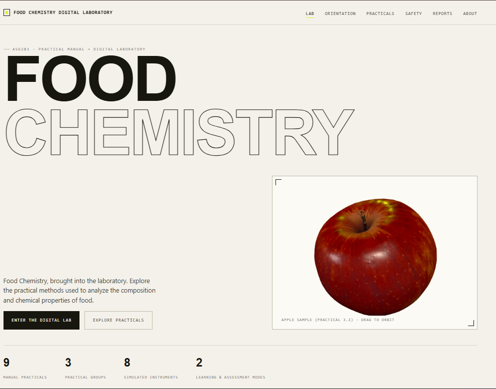

# Food Chemistry Digital Laboratory

An interactive digital laboratory built directly from the supplied **Practical
Manual:Food Chemistry (AS6201)** (Department of Applied Sciences, Mbeya
University of Science and Technology). Every practical, safety rule, hazard
note, procedure, formula and acceptance criterion in this site is sourced from
that manual:see `docs/manual-mapping.md` for a full feature-by-feature trace
back to the source document.

## The Design Overview



## Description

Read the manual → enter the digital lab → select a practical → prepare
apparatus → perform the procedure → record measurements → calculate the
result → check it against the manual's own acceptance criteria → draft a
guided practical report. Nine practicals are implemented: Laboratory
Orientation, and Practicals 2.1–2.5 and 3.1–3.3 (crude protein, total fat,
starch, HPLC sugars, ash, pH & titratable acidity, vitamin C, and total
soluble solids).

## Technology

- HTML5, CSS3, vanilla JavaScript (ES modules):no framework, no build step.
- [Three.js](https://threejs.org) (vendored locally, no CDN dependency) for
  the hero laboratory-glassware scene, using `GLTFLoader`, `OrbitControls` and
  `RGBELoader`.
- No bundler required:the site runs directly from static files.

## Features

- **Laboratory orientation**:an interactive floor-plan of the manual's
  health-and-safety equipment (emergency exit, phone, fire alarm, extinguisher,
  safety shower, eyewash, first-aid kit, group bench).
- **Laboratory safety rules**:the manual's full A–I rule set (general,
  chemical handling, warning labels, accidents, fire, emergencies, biological
  safety, broken glass, cleaning) in an accordion reference.
- **Nine interactive practicals**, each with: Overview (objective, definition,
  principle), Materials & Apparatus, Safety (hazard acknowledgement gate),
  Procedure (step-by-step, apparatus selection), Measure & Calculate (a real
  simulated instrument:balance, burette, pH meter, refractometer, furnace
  gauge, or HPLC chromatogram:wired to the manual's own formula with a
  transparent inputs → formula → substitution → result panel), Results
  (PASS/CHECK against the manual's own acceptance criteria, with duplicate
  measurements), and Report (a guided, research-article-style report drafted
  from the learner's own recorded results, plus a checklist mirroring the
  manual's report marking scheme).
- **Learning mode / Assessment mode**:Learning mode pre-fills a plausible
  worked example; Assessment mode starts blank so a learner enters their own
  duplicate measurements.
- **3D food sample**:the supplied apple model, rendered
  live with Three.js and orbit controls, with a clean SVG technical-diagram
  fallback if WebGL is unavailable.
- **Responsive design**:full desktop, tablet and mobile layouts; the mobile
  nav collapses to a toggle menu and every practical control remains usable at
  narrow widths.
- **Accessibility**:semantic HTML, visible focus states, a skip link,
  keyboard-operable controls, `prefers-reduced-motion` support (disables
  scroll-reveal animation and 3D auto-rotate), and text alternatives to the 3D
  scene.
- **Report export**:download any practical's draft report as Markdown, or
  print/save as PDF via the browser's print dialog.
- **Session persistence**:progress, measurements and report drafts persist
  in `localStorage`, so a learner's session survives a page reload. Each
  practical has a "Reset runs" control to start over.

## Installation

No build step and no dependencies to install. Everything needed to run is
already inside this folder, including a locally vendored copy of Three.js
(`js/vendor/three/`):no CDN or internet connection required.

## Running

Because the app uses ES modules (`<script type="module">`) and `fetch`s a
`.glb`/`.hdr` asset, most browsers require it to be served over HTTP rather
than opened directly as a `file://` URL. From this folder, run any static file
server, for example:

```bash
python3 -m http.server 8000
# then open http://localhost:8000/ in a browser
```

or, with Node installed:

```bash
npx serve .
```

## Data

No external food-composition dataset was supplied with this project package
(no `data/` folder was present alongside the manual, design reference and 3D
assets), so none is referenced or fabricated. All numeric examples shown in
Learning Mode are clearly sourced as manual-defined defaults or worked
examples:see `js/data/practicals-data.js`, where every input carries a
`source: "user"` tag, and `docs/manual-mapping.md` for the two places the
manual itself did not specify a value (the Kjeldahl conversion-factor default,
and the absence of a numeric duplicate-difference threshold for Practical
3.1).

## Scientific source

The supplied **Practical Manual:Food Chemistry (AS6201)** is the primary and
authoritative source for every practical's science. See
`docs/scientific-sources.md` for the manual's own reference list, and
`docs/manual-mapping.md` for a feature-by-feature map back to the manual's
sections.

## 3D assets

`assets/3d/` contains the supplied glTF/GLB models, downsampled for web
performance (2k/8k textures resized to 1024px, quality 78; the HDRI resized
from 2048×1024 to 1024×512). Only the apple model is currently
mounted in a live Three.js scene (the hero); the bunsen burner, wooden table
and Erlenmeyer flask set are vendored and ready for a maintainer to mount in a future
scene extension. See `docs/asset-credits.md` for the full inventory, including
assets that were supplied but intentionally not integrated, and why.

## Licenses

See `docs/asset-credits.md` for per-asset licensing information:one asset
(`Glass Beaker Cycles.zip`) carries an explicit, bundled Creative Commons Zero
license; others follow a file-naming convention consistent with Poly Haven's
CC0 assets but were not accompanied by an explicit license file in the
supplied package, so this is noted as an inference rather than a confirmed
fact. Verify independently before commercial reuse.

## Disclaimer

This is an educational digital simulation of the practicals described in the
Food Chemistry Practical Manual (AS6201). It is **not** a substitute for
supervised laboratory work. Any real handling of the acids, solvents, heat
sources or other hazards described here must be carried out under qualified
supervision, following your institution's own safety procedures.

## Project structure

```
food-chemistry-laboratory/
  index.html
  css/            variables, base, layout, components, instruments, practicals, animations, responsive
  js/
    main.js                 application entry point
    state.js                 progress/measurement persistence (localStorage)
    navigation.js             nav + scroll-spy
    accessibility.js          reveal-on-scroll, skip link, reduced-motion
    calculation-engine.js     manual formulas + acceptance-criteria checks
    practical-engine.js       renders the full interactive practical workspace
    instrument-widgets.js     balance, burette, pH meter, refractometer, furnace gauge, chromatogram
    feedback-engine.js        manual-tied scientific feedback messages
    report-engine.js          guided report builder + marking-scheme checklist
    orientation-engine.js     Practical 1 floor-plan hotspots
    webgl-scene.js            Three.js hero scene + WebGL-fallback detection
    data/
      manual-core.js          safety rules, orientation, report guidelines, marking scheme, sources
      practicals-data.js      practicals 2.1–3.3: objective, principle, materials, apparatus, hazards,
                               procedure, calculation spec, acceptance criteria, references
    vendor/three/             locally vendored Three.js + GLTFLoader/OrbitControls/RGBELoader
  assets/
    3d/                       supplied 3D models (downsampled)
    hdri/                     supplied HDRI (downsampled)
  FOOD_CHEMISTRY_PRACTICAL_MANUAL_GUIDEBOOK/
    Practical Manual-Food Chemistry-AS6201.docx
  docs/
    manual-mapping.md         feature → manual section map
    scientific-sources.md     manual's own references
    asset-credits.md          3D asset sources, licensing, and what was left out
  README.md
```

## Known limitations

- No external food-composition dataset was supplied, so food-identity context
  (e.g. linking a sample to USDA-style composition data) is out of scope for
  this build:see **Data** above.
- The Kjeldahl practical's nitrogen→protein conversion factor is user-entered
  rather than looked up from a food-specific table, because the manual's own
  Appendix table was not included in the supplied document (see
  `docs/manual-mapping.md`).
- Only the apple model is mounted in a live 3D scene; the bunsen
  burner, table, Erlenmeyer flasks and HDRI assets are vendored but not yet placed into a
  full 3D laboratory environment (no browser-side Blender/glTF conversion
  toolchain was available to bring in the supplied Blender beaker source or
  the 4k chemistry-set asset:see `docs/asset-credits.md`).
- The digital instruments (balance, burette, pH meter, refractometer, furnace
  gauge, chromatogram) are functional data visualizations driven by the
  learner's entered values, not physics simulations of the real apparatus.
